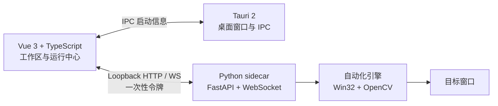

<div align="center">
  
  <h1>Macro Studio</h1>
  <p><strong>面向 Windows 桌面应用的可视化自动化工作室</strong></p>
  <p>采集目标、编排动作、识别界面，并以可检查、可暂停、可恢复的方式运行自动化流程。</p>
  <p>
    
    
    
    
    
    
    <a href="LICENSE"></a>
  </p>
  <p>
    <a href="#快速开始">快速开始</a> ·
    <a href="#核心能力">核心能力</a> ·
    <a href="#动作类型">动作类型</a> ·
    <a href="#项目架构">项目架构</a> ·
    <a href="docs/TAURI_REFACTOR_STRATEGY.md">重构策略</a>
  </p>
</div>

> [!IMPORTANT]
> 当前版本处于活跃开发阶段，以 `npm run dev` 启动完整的 Tauri 开发应用。生产安装包仍需要完成 Python sidecar 打包，暂不建议将开发构建当作无人值守服务。

> [!CAUTION]
> 本项目用于个人自动化和辅助操作。请遵守目标软件的用户协议、社区规则与当地法律法规，并始终为真实执行保留人工急停手段。

## 为什么是 Macro Studio

Macro Studio 最初来自一个很具体的问题：让一组作品按顺序完成搜索、选择与播放。随着点位、图像识别、键盘宏、失败恢复和运行计划逐渐成熟，它已经成为一个更通用的 Windows 自动化工作台。

<table>
  <tr>
    <td width="50%" valign="top">
      <h3>可视化目标</h3>
      <p>用 F8 采集窗口相对点位，或从剪贴板导入模板。支持识别区域、遮罩、边缘匹配与命中预览。</p>
      <sub>POINTS · IMAGE TARGETS · MASKS</sub>
    </td>
    <td width="50%" valign="top">
      <h3>可编排工作流</h3>
      <p>组合鼠标、键盘、粘贴、等待、日志、URI 与 HTTP 动作；支持拖拽排序、预设、变量和逐项失败策略。</p>
      <sub>WORKFLOWS · PRESETS · VARIABLES</sub>
    </td>
  </tr>
  <tr>
    <td width="50%" valign="top">
      <h3>可靠运行</h3>
      <p>运行前检查引用和时长，加速演练完整时间线；真实执行支持暂停、停止、F9 急停、重试和回退。</p>
      <sub>PLAN · REHEARSAL · RECOVERY</sub>
    </td>
    <td width="50%" valign="top">
      <h3>后台协作</h3>
      <p>优先通过窗口消息和后台截图减少对物理鼠标的占用，也可在兼容性需要时切换到前台输入。</p>
      <sub>WIN32 · SIDECAR · OPENCV</sub>
    </td>
  </tr>
</table>

## 核心能力

| 能力 | 当前实现 |
| --- | --- |
| 目标管理 | 点位分组、F8 热键采集、十字线预览、窗口相对坐标、图像目标库 |
| 视觉识别 | OpenCV 灰度/边缘/遮罩边缘匹配、智能策略、区域截图、置信度与调试预览 |
| 工作流 | 动作增删改、复制、拖拽排序、预设管理、单步测试、动作后等待 |
| 运行队列 | 分组、条目级工作流、变量渲染、单次/循环/随机运行 |
| 可靠性 | 运行计划、加速演练、失败重试、回退到上一个图像或点击动作、点击后验证 |
| 剧组站 | 游戏参数监听、分类搜索、封面与时长、热度排序、作品加入队列 |
| 运行控制 | 全局日志、可调节日志面板、暂停/继续、停止、F9 急停 |
| 输入方式 | 后台窗口消息、前台输入、执行前聚焦、可选点击位置预览 |
| 本地安全 | loopback API、一次性会话令牌、个人配置与模板默认忽略提交 |

## 快速开始

### 环境要求

- Windows 10/11
- Node.js 20+
- Rust stable 工具链
- Python 3.10+

### 安装依赖

```powershell
git clone https://github.com/FreeXMelody/macro-studio.git
Set-Location macro-studio

npm install
npm --prefix frontend install
python -m pip install -r requirements.txt
```

### 启动桌面应用

```powershell
npm run dev
```

启动器会定位 rustup 安装的 Cargo，运行 Vue 开发服务器，构建 Tauri，并自动启动 Python sidecar。Vue 通过 Tauri IPC 获取本次运行的一次性端口与令牌。

如果系统盘空间有限，可以把 Rust 构建目录放到其他磁盘：

```powershell
Set-Content .cargo-target 'D:\CargoTarget\macro-studio'
npm run dev
```

`.cargo-target` 只保存在本机，不会被 Git 提交。

### 只运行浏览器开发栈

无需 Rust、只调试界面与 sidecar 时：

```powershell
npm run web:dev
```

单独执行 `npm run frontend:dev` 不会启动 sidecar，因此动作测试、目标采集和真实运行会保持未连接状态。

## 第一个工作流

<table>
  <tr>
    <td width="25%" valign="top"><strong>01 · 连接</strong><br><sub>在“设置”中填写目标窗口关键词并运行连接检查。</sub></td>
    <td width="25%" valign="top"><strong>02 · 采集</strong><br><sub>创建点位后按 F8 采集，或导入截图建立图像目标。</sub></td>
    <td width="25%" valign="top"><strong>03 · 编排</strong><br><sub>在“工作流”中组合点击、按键、粘贴和等待动作。</sub></td>
    <td width="25%" valign="top"><strong>04 · 运行</strong><br><sub>先检查计划或加速演练，再切换实际模式执行。</sub></td>
  </tr>
</table>

运行中按 `F9` 可请求全局急停。建议先在无副作用的窗口中验证新工作流，再用于目标程序。

## 图像识别工作流

`image_click` 适合处理按钮位置变化、窗口移动或“只有出现某个状态才点击”的场景。

1. 使用 `Win + Shift + S` 截取尽量紧凑的目标图标。
2. 在“目标”页面从剪贴板导入并命名模板。
3. 选择窗口相对识别区域；留空表示完整目标窗口。
4. 按模板特征选择匹配方式，并视需要编辑有效像素遮罩。
5. 先运行“测试识别”，确认置信度和调试预览，再加入工作流。

| 匹配方式 | 适用情况 |
| --- | --- |
| `grayscale` | 图标纹理和亮度稳定，模板背景干净 |
| `edge` | 图标轮廓稳定，但背后游戏场景变化明显 |
| `masked_edge` | 只希望指定轮廓或像素参与比较 |
| `smart` | 让执行器根据目标配置选择合适策略 |

边缘低/高阈值控制 Canny 边缘提取，只影响边缘类算法。阈值越低，保留细节越多，也更容易带入背景噪声；阈值越高，轮廓更干净，也可能漏掉较淡边缘。

## 动作类型

| 类型 | 用途 | 示例 |
| --- | --- | --- |
| `click` | 点击已配置点位 | `搜索框` |
| `image_click` | 识别图像目标并点击 | `播放按钮` |
| `paste` | 粘贴文本，支持条目变量 | `{keyword}` |
| `wait` | 等待秒数或时间格式 | `2.5` / `00:30` |
| `key` | 单击一个键 | `space` / `f5` |
| `key_hold` | 长按一个键 | `space@0.8` |
| `key_down` / `key_up` | 分离按下与抬起 | `shift` |
| `hotkey` | 单击组合键 | `ctrl+v` |
| `hotkey_hold` | 长按组合键 | `ctrl+space@0.5` |
| `enter` / `ctrl_a` | 常用键盘快捷动作 | 无额外参数 |
| `open_uri` | 打开网页或 Windows 协议链接 | `https://...` |
| `http_request` | 发送一次 HTTP 请求 | `GET http://127.0.0.1:...` |
| `log` | 写入调试日志 | `已进入搜索页` |

除 `wait` 外，每个动作都可以设置“动作后等待”。键盘动作支持字母、数字、方向键、功能键、小键盘键位以及 `vk:0x20` 形式的 Windows 虚拟键码。

## 队列变量

工作流参数可以引用当前运行条目的数据：

| 变量 | 含义 |
| --- | --- |
| `{title}` | 条目名称 |
| `{keyword}` | 输入或搜索文本 |
| `{duration}` | 内容时长，单位为秒 |
| `{buffer}` | 额外缓冲时间，单位为秒 |
| `{total}` | 内容时长与缓冲时间之和 |

例如，`paste` 使用 `{keyword}` 输入当前条目的搜索词，`wait` 使用 `{total}` 等待内容播放结束。前端通过通用 `RunItem` 适配器读取现有歌单数据，后续可以接入非音乐任务集而不破坏存量 JSON。

## 项目架构



| 路径 | 职责 |
| --- | --- |
| `frontend/` | Vue 3 UI、Pinia 状态、API 客户端与交互组件 |
| `src-tauri/` | Tauri 生命周期、sidecar 启动和桌面应用配置 |
| `backend/` | 应用服务、运行计划、执行编排与本地 HTTP/WebSocket 接口 |
| `automation.py` | Windows 输入与窗口自动化实现 |
| `vision.py` | OpenCV 模板、遮罩和边缘匹配 |
| `tests/` | Python 后端与执行器回归测试 |
| `docs/` | 重构策略、架构决策与品牌资源 |

## 本地数据与隐私

| 本地内容 | 用途 | Git 策略 |
| --- | --- | --- |
| `macro_config.json` | 窗口、点位、工作流、目标和本地服务配置 | 默认忽略 |
| `playlist.json` | 队列分组与条目变量 | 默认忽略 |
| `image_templates/` | 从剪贴板或选区生成的模板 | 默认忽略 |
| `.cargo-target` | 当前机器的 Rust 构建目录 | 默认忽略 |

仓库只提供脱敏示例：`macro_config.example.json` 与 `playlist.example.json`。不要提交真实坐标、截图、会话票据或包含个人路径的诊断报告。

```powershell
Copy-Item macro_config.example.json macro_config.json
Copy-Item playlist.example.json playlist.json
```

## 开发与验证

```powershell
# Python 后端测试
python -m unittest discover -s tests -p "test_*.py"

# Vue 单元测试与生产构建
npm --prefix frontend run test -- --run
npm --prefix frontend run build
```

完整迁移原则、阶段边界和验收标准见 [`docs/TAURI_REFACTOR_STRATEGY.md`](docs/TAURI_REFACTOR_STRATEGY.md)。

<details>
<summary><strong>实验性剧组站扩展</strong></summary>

项目仍保留剧组站搜索、作品元数据读取、时长回填、只读参数捕获和本地诊断模块。这些能力来自最初的播放队列需求，目前正在逐步迁移到新 Tauri 界面。

`role_id` 与 `user_id` 是角色标识，`skey` 是可能过期的会话票据。它们只应保存在本地 `macro_config.json`，不要写入 README、Issue、日志示例或 Git 提交。

</details>

## 路线图

- 动作后状态验证与可组合断言
- 条件分支、跳转和更清晰的失败路径
- 通用任务集模型，逐步解除队列与音乐语义的绑定
- Python sidecar 的生产打包与签名安装程序
- OCR 与更高级的视觉判断

## License

Macro Studio 使用 [MIT License](LICENSE)。
