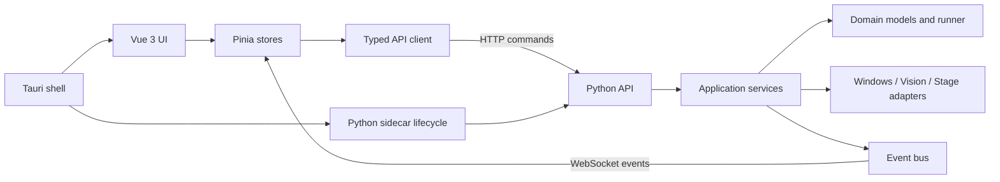

# Macro Studio 重构任务与执行策略

## 任务目标

将现有 Macro Studio 从 Python + Tkinter 桌面程序逐步迁移为：

- 前端：Vue 3 + TypeScript + Vite
- 桌面外壳：Tauri
- 状态管理：Pinia
- Python 后端：保留现有自动化、视觉识别、剧组接口与网络监听能力
- 通信：本地 HTTP API + WebSocket 事件流
- 平台：Windows 10/11 x64

这是一项渐进式架构迁移，不是重新开发。迁移期间，现有 Tkinter 版本必须始终保持可运行和可回退。

## 当前项目事实

当前项目的核心能力已经部分模块化：

| 模块 | 当前职责 | 迁移原则 |
| --- | --- | --- |
| `macro_studio.py` | Tkinter UI、状态管理、动作调度、线程回传及业务编排 | 逐步抽离业务逻辑，最终仅保留旧版 UI 适配 |
| `actions.py` | 动作类型定义与表单元数据 | 直接复用，补充可序列化契约 |
| `models.py` | 点位、图像目标、动作、歌曲和分组模型 | 保持数据兼容，逐步迁移为明确 DTO |
| `automation.py` | Windows 鼠标、键盘、窗口消息与剪贴板操作 | 作为 Windows 基础设施层保留 |
| `vision.py` | OpenCV 模板匹配与 Windows Graphics Capture | 保留算法，增加服务接口和可测试适配器 |
| `stage_api.py` | 剧组站作品搜索、封面和时长读取 | 作为剧组服务基础设施保留 |
| `stage_http_listener.py` | 通过 WinDivert 捕获游戏搜索参数 | 保留 UAC 辅助进程模式，不改为代理抓包 |
| `stage_transport.py` | URL、协议和 HTTP 请求实验 | 收敛为传输适配器 |
| `storage.py` | JSON 配置读取与保存 | 增加 schema version、原子写入和备份 |
| `stage_diagnostics.py` | 本地缓存、日志和模块诊断 | 作为诊断服务保留 |

不得把已经抽离的能力重新复制进 FastAPI 路由、Tauri Rust 命令或 Vue 组件。

## 不可破坏的行为

重构前必须为以下行为建立特征测试或可重复验收步骤：

- 点位组、图像目标、动作预设和歌曲组的增删改查
- 歌曲继承分组预设，以及歌曲单独指定动作预设
- 动作拖拽排序、复制、启用和禁用
- `click`、`image_click`、`paste`、`wait`、键盘与组合键动作
- 前台输入与窗口消息输入模式
- 图像目标持续重试、回退到上一个图像动作和最终失败
- 播放一次、顺序播放、循环播放、随机播放
- 暂停、继续和 F9 强制停止
- 剧组站登录参数自动捕获、作品搜索、排序、封面和时长读取
- 现有 `macro_config.json` 与 `playlist.json` 无损读取

任何阶段未通过以上验收，不得删除旧实现。

## 目标架构



### 分层边界

建议目标目录：

```text
backend/
  domain/
    models.py
    action_specs.py
    runner_state.py
  application/
    sequence_runner.py
    playlist_service.py
    preset_service.py
    target_service.py
    stage_service.py
    settings_service.py
  infrastructure/
    windows_automation.py
    vision.py
    stage_api.py
    stage_http_listener.py
    json_storage.py
  transport/
    http_api.py
    websocket_events.py
  main.py

frontend/
  src/
    api/
    components/
    composables/
    pages/
    stores/
    styles/
    types/

src-tauri/
  src/
  capabilities/
  tauri.conf.json
```

目录结构是目标，不要求第一步机械搬动全部文件。优先通过稳定接口解除 `macro_studio.py` 的耦合。

## Python 服务设计

### 应用服务

至少抽出以下 UI 无关服务：

- `SequenceRunner`：动作执行、暂停、继续、停止、循环、随机与恢复策略
- `PlaylistService`：歌曲组、歌曲顺序和预设分配
- `PresetService`：动作序列及预设生命周期
- `TargetService`：点位组、图像模板、识别区域和阈值
- `StageService`：登录参数捕获、作品搜索和元数据读取
- `SettingsService`：目标窗口、输入模式、热键和外观设置

服务不得依赖 Tkinter 控件、`StringVar`、`messagebox` 或 `after()`。

### 运行状态机

动作执行统一使用明确状态：

```text
idle -> starting -> running <-> paused
                     |
                     +-> stopping -> stopped
                     |
                     +-> completed
                     |
                     +-> failed
```

强制停止必须拥有最高优先级。后台线程、图像重试、等待和歌曲切换都必须响应同一个取消信号。

### 命令与事件

HTTP API 负责有限、可确认的命令，例如：

- `POST /api/runner/start`
- `POST /api/runner/pause`
- `POST /api/runner/resume`
- `POST /api/runner/stop`
- `GET /api/playlists`
- `PUT /api/playlists`
- `GET /api/presets`
- `PUT /api/presets`
- `GET /api/targets`
- `PUT /api/targets`
- `POST /api/stage/capture-auth`
- `POST /api/stage/search`
- `GET /api/settings`
- `PUT /api/settings`

WebSocket 只推送事件，例如：

- `runner.state_changed`
- `runner.step_started`
- `runner.step_retrying`
- `runner.step_failed`
- `runner.song_changed`
- `log.appended`
- `stage.capture_changed`

所有请求和事件都必须拥有 TypeScript 与 Python 对应的数据模型。

## 本地通信与安全

- Python 服务只监听 `127.0.0.1`。
- 使用系统分配的随机端口，不写死公开端口。
- Tauri 启动 sidecar 时生成一次性会话令牌。
- Vue 的每个 HTTP/WebSocket 请求都必须携带会话令牌。
- `skey`、本地路径和模板图片不得写入普通日志。
- API 不提供任意文件读取、任意命令执行或任意 URL 代理接口。
- WinDivert 继续由一次性 UAC 辅助进程负责；主 UI 不要求始终以管理员身份运行。
- sidecar 退出、崩溃或失联时，UI 必须进入可恢复状态并显示明确错误。

开发阶段可以使用 FastAPI + Uvicorn。打包阶段仍由 Tauri 负责 sidecar 的启动、健康检查和优雅关闭。

## UI 信息架构

### 全局框架

- 左侧主导航：运行、歌单、工作流、目标库、剧组站、设置
- 顶部状态区：目标进程、连接状态、当前输入模式
- 常驻运行控制条：开始、暂停/继续、停止、当前歌曲和当前动作
- 日志使用可折叠底部面板，不单独占据主要工作流
- 窗口尺寸变化时保持主要控件可见，不依赖用户反复拖动窗口边框

### 页面

#### 运行中心

显示当前歌单、动作预设、执行进度、重试状态和最近日志。开始、暂停和停止必须始终可见。

#### 歌单

使用分栏或数据表管理歌曲组与歌曲。支持移动、复制、排序、循环、随机及单曲预设分配。

#### 工作流

动作序列使用稳定行高的可拖拽列表。类型具有颜色标识；选中、焦点、拖动占位和错误状态必须同时可辨认。

#### 目标库

通过标签页管理点位组和图像目标。图像模板应提供大尺寸预览、识别区域可视化、点击位置预设和测试识别。

#### 剧组站

保留作品卡片结果，但配置和登录态捕获放入可折叠高级区域。主要流程是搜索、排序、选择和加入歌单。

#### 设置

管理目标窗口、输入模式、快捷键、数据目录、主题和诊断信息。

## 视觉与交互原则

这是高频操作工具，不是营销页面。

- 深色主题可以保留，但避免大面积毛玻璃、装饰渐变和过度卡片化。
- 页面使用清晰分区、紧凑表格、分栏布局和稳定尺寸。
- 卡片仅用于作品、模板等确实需要预览的重复对象。
- 使用 Lucide 图标；熟悉的工具动作优先使用图标按钮并提供 tooltip。
- 颜色用于状态、动作类型和风险提示，不用单一色相统治整个界面。
- 动画只表达状态变化：拖拽、展开、加载、成功和失败。
- 所有列表必须具有明确的选中、键盘焦点、拖动和禁用状态。
- 控件在 1366x768、1920x1080 和常见缩放比例下不得被裁切。
- 不在界面中堆放“如何使用本界面”的说明文字。

## Tauri 与 Python sidecar

- Python 后端使用 PyInstaller 或 Nuitka 生成独立 sidecar。
- Tauri 配置 sidecar 二进制并负责进程生命周期。
- 打包时验证 OpenCV、Windows Graphics Capture、WinDivert DLL/驱动和图片依赖。
- 开发模式允许单独启动前端和后端；生产模式不得要求用户安装 Python、Node.js 或 Rust。
- 主程序关闭时必须请求 runner 停止、释放热键和网络监听，再终止 sidecar。
- 首个发布目标仅为 Windows x64，不提前扩展跨平台抽象。

## 迁移阶段

### 阶段 0：建立安全基线

输出：

- 当前版本提交与 GitHub 分支
- 配置文件隐私检查
- 关键行为验收清单
- 架构决策记录
- 可重复的测试命令

验收：旧版可以从干净环境安装并运行。

### 阶段 1：抽离 Python 应用层

从 `macro_studio.py` 提取运行器和服务，Tkinter 改为调用这些服务。

验收：旧 UI 的操作行为和配置文件保持兼容。

### 阶段 2：建立本地 API 与事件流

加入 FastAPI、健康检查、会话令牌、命令接口和 WebSocket 事件。

验收：在不打开 Tkinter 的情况下，可以通过测试客户端完成一次模拟动作流程。

### 阶段 3：创建 Tauri + Vue 基础应用

建立 Vite、Vue 3、TypeScript、Pinia、Vue Router、API client 和 Tauri sidecar 管理。

验收：桌面窗口能启动后端、显示连接状态，并在关闭时正确清理后端。

### 阶段 4：按功能纵向迁移

迁移顺序：

1. 运行中心与日志
2. 歌单
3. 工作流与动作预设
4. 点位组与图像目标
5. 剧组站
6. 设置与诊断

每迁移一个页面，都要完成真实功能、加载/空/错误状态和回归测试，不创建只有外观的占位页面。

### 阶段 5：打包与切换

完成 sidecar 打包、Tauri 安装包、数据迁移、升级与回滚验证。

只有当新版覆盖全部关键行为后，才停止维护 Tkinter UI。旧版代码至少保留一个发布周期。

## Git 策略

- `main` 保存迁移前稳定基线及后续经过验证的合并结果。
- `refactor/tauri-vue3` 用于架构迁移。
- 大功能使用该分支下的短期子分支或小提交。
- 禁止把 `macro_config.json`、`playlist.json`、模板截图、诊断报告或真实 `skey` 提交到仓库。
- 每个迁移提交必须说明兼容性、验证命令和剩余风险。
- 不删除旧实现来换取短期编译通过。

## 首轮执行要求

开始编码前，先输出：

1. 当前模块与依赖关系。
2. `macro_studio.py` 中需要抽离的职责。
3. Python 应用服务接口草案。
4. HTTP/WebSocket 数据契约草案。
5. Vue 页面与 Pinia store 对应关系。
6. sidecar 开发和生产启动流程。
7. 阶段 0 与阶段 1 的文件级实施计划。

首轮只允许完成阶段 0 和阶段 1 的最小安全改动，不直接删除 Tkinter UI，也不一次性搬动全部文件。

## 完成定义

重构只有同时满足以下条件才算完成：

- 原有关键功能全部迁移并通过验收。
- 旧配置能够自动迁移且保留备份。
- 强制停止、异常恢复和 sidecar 崩溃处理经过测试。
- 新 UI 在常见桌面尺寸和缩放下没有裁切或重叠。
- 安装包不要求用户额外安装开发环境。
- GitHub 仓库不包含本地密钥、私人歌单、截图或诊断数据。
- README、架构文档、开发命令和发布流程与实际实现一致。
